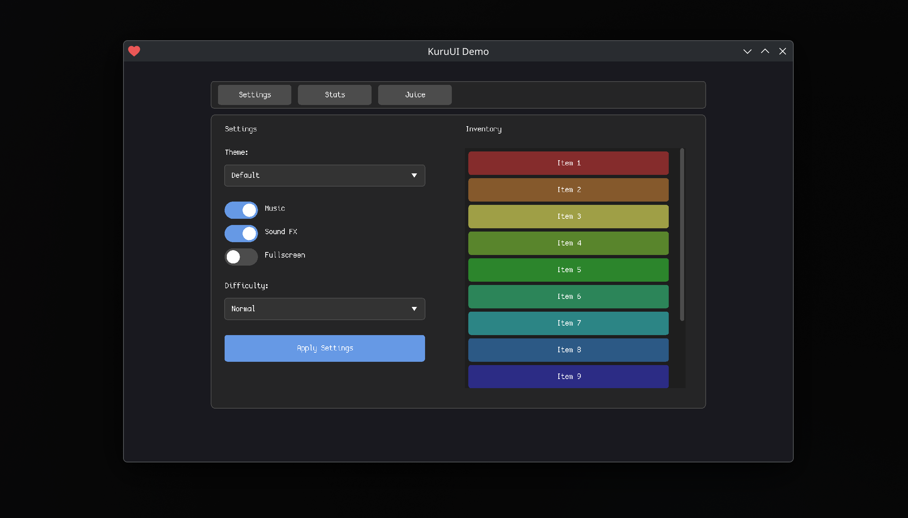
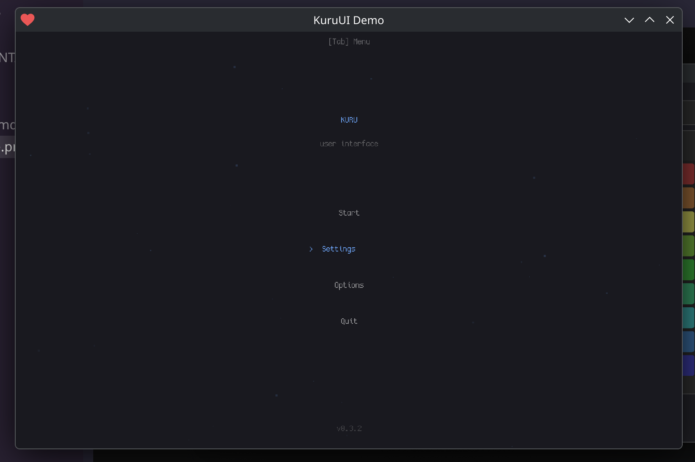

# KuruUI

A Love2D UI library.

This is my personal UI library I made for myself. Thought I'd share it in case someone finds it useful.




## Features

- 12 UI components (Button, Label, Panel, Slider, Checkbox, TextInput, ProgressBar, Toggle, Dropdown, Tooltip, ScrollArea, Tabs)
- Tweening system with 18 easing functions
- Theme system with 2 built-in themes (Default, ImGui) and custom theme support
- Juice animation effects (shake, pop, punch, bounce, flash, pulse, heartbeat, typewriter, etc.)
- Fullscreen scaling with automatic coordinate conversion
- Pixel-perfect rendering support

## Quick Start

```lua
local KuruUI = require("kuruui")

function love.load()
    KuruUI.enableScaling(800, 600)

    local panel = KuruUI.add(KuruUI.Panel:new(50, 50, 300, 200))
    local button = panel:addChild(KuruUI.Button:new(20, 20, 260, 40, "Click Me"))
    button.onClick = function()
        print("Clicked!")
    end
end

function love.update(dt)
    KuruUI.update(dt)
end

function love.draw()
    KuruUI.draw()
end

function love.mousepressed(x, y, button)
    KuruUI.mousepressed(x, y, button)
end

function love.mousereleased(x, y, button)
    KuruUI.mousereleased(x, y, button)
end

function love.wheelmoved(x, y)
    KuruUI.wheelmoved(x, y)
end

function love.keypressed(key)
    KuruUI.keypressed(key)
end

function love.textinput(text)
    KuruUI.textinput(text)
end

function love.resize(w, h)
    KuruUI.resize(w, h)
end
```

## Documentation

See [DOCUMENTATION.md](DOCUMENTATION.md) for full API reference.

## License

Do whatever you want with it.
